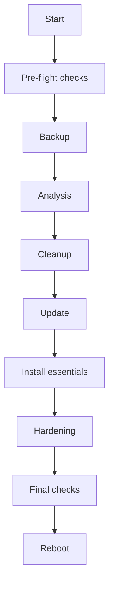

# Minimal OS Preparation Tool

This tool automates transforming a Linux system into a minimal, clean, hardened base image suitable for production.

## Architecture / Flow



## Default package actions

- **Removed**: `snapd`, `apport`, `whoopsie`, `popularity-contest`, `ubuntu-release-upgrader-core`, `landscape-client`, `cloud-init`, `lxd`, `lxd-client`
- **Essential installs**: `openssh-server`, `sudo`, `curl`, `wget`, `vim`, `git`, `net-tools`, `ca-certificates`

## Running the tool

```bash
sudo ./minimal-os-tool.sh            # headless
sudo ./minimal-os-tool.sh -i         # interactive
sudo ./minimal-os-tool.sh -n         # dry-run
```

Logs are written to `/var/log/minimal-os-tool.log`. A backup of `/etc` and the installed package list is placed in `/var/backups/minimal-tool/`.

## Sample output (dry-run)

```
$ sudo ./minimal-os-tool.sh -n
[2025-02-14 12:00:00] --- Pre-flight checks ---
[2025-02-14 12:00:00] Package manager: apt
[2025-02-14 12:00:00] --- Backup phase ---
[DRY-RUN] mkdir -p /var/backups/minimal-tool
...
[2025-02-14 12:00:00] Completed. Reboot recommended.
```

## Testing in a VM

1. Create a fresh VM (Ubuntu Server or Rocky Linux).
2. Snapshot the VM before running the script.
3. Copy `minimal-os-tool.sh` to the VM.
4. Run a dry run first: `sudo ./minimal-os-tool.sh -n`.
5. If results look safe, run: `sudo ./minimal-os-tool.sh`.
6. Reboot and verify:
   - SSH connectivity
   - `systemctl --failed` shows no failures
   - `systemd-analyze` reports improved boot time

## Boot time optimisation tips

- Use `systemd-analyze blame` to identify slow services.
- Mask unneeded services with `systemctl mask <service>`.
- Disable graphical targets if not required: `systemctl set-default multi-user.target`.

## Common pitfalls

Removing critical packages such as network tools or SSH may lock you out. Always review the package lists and run in a disposable environment first.
